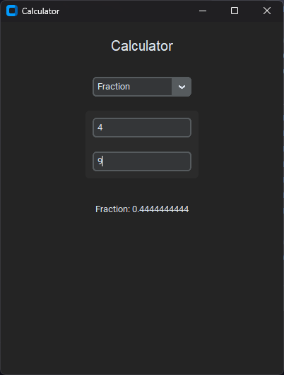

<h3 align="center">
	Calculator
	
</h3>

<p align="center">
	<a href="https://github.com/scarcekoi/Calculator/stargazers"></a>
	<a href="https://github.com/scarcekoi/Calculator/issues"></a>
	<a href="https://github.com/scarcekoi/Calculator/contributors"></a>
</p>

---

## 🧑‍💻 **Available Calculations**:
1. **Area**: Calculate the area of a rectangle (length × width).
2. **Circle Area**: Calculate the area of a circle (π × radius²).
3. **Circumference**: Calculate the circumference of a circle (2 × π × radius).
4. **Fraction**: Calculate the result of a division (numerator / denominator).
5. **Perimeter**: Calculate the perimeter of a rectangle (2 × (length + width)).
6. **Volume**: Calculate the volume of a rectangular prism (length × width × height).
7. **Radius**: Calculate the radius of a circle from its diameter (diameter / 2).

---

## ⚙️ **How to Use**:

1. **Select the Calculation Type**: From the dropdown menu, choose the type of calculation you want to perform (e.g., Area, Circle Area, Fraction, etc.).
2. **Enter the Required Values**: The input fields will automatically appear based on your selection. Enter the required values.
3. **View the Result**: As you type, the result will be automatically updated and formatted in real time.
   - For example, entering `4` as a radius for a circle will display the result as `Area: 50.2654824574`, but entering `4.0000` will show `Area: 50.2654824574` (without extra zeros).

---

## 📸 **Screenshots**:

**Interactive UI** that updates instantly with user input.



---

## 🛠 **Installation & Setup**:

### Prerequisites:
- **Python 3.8+** installed. You can download Python from the official website: [python.org](https://www.python.org/downloads/).
- **CustomTkinter** library for the GUI:

### Step 1: Install CustomTkinter

To install the **CustomTkinter** library, run the following command in your terminal or command prompt:

```bash
pip install customtkinter
```

### Step 2: Clone the Repository

Clone this repository to your local machine using:

```bash
git clone https://github.com/scarcekoi/Calculator
```

### Step 3: Run the Application

Navigate to the directory where the project was cloned and run the Python file:

```bash
cd Calculator
python main.py
```

<p align="center">
	<a href="https://github.com/scarcekoi/Calculator/blob/main/LICENSE"></a>
</p>
